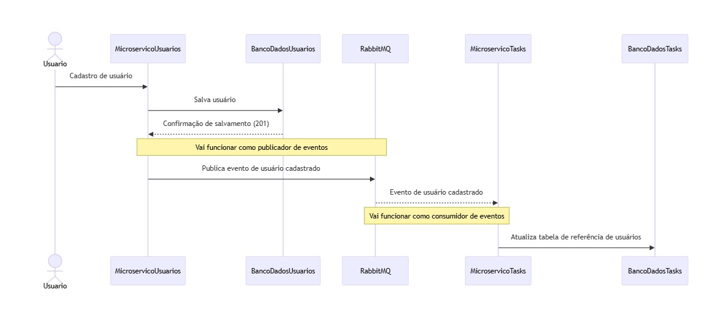

# Arquivos de Registro Arquitetural (ADR)

Este documento contém registros das decisões arquiteturais tomadas durante o desenvolvimento do projeto.

## Conteúdo

- [Decisão 1: Uso de Docker Compose](#decisão-1-uso-de-docker-compose)
- [Decisão 2: Escolha de Keycloak como Provedor de Identidade](#decisão-2-escolha-de-keycloak-como-provedor-de-identidade)
- [Decisão 3: Integração com RabbitMQ](#decisão-3-integração-com-rabbitmq)
- [Decisão 4: Uso de Mensageria para Coreografia entre Microserviços](#decisão-4-uso-de-mensageria-para-coreografia-entre-microserviços)
  
## Decisão 1: Uso de Docker Compose

### Contexto

Decidimos usar Docker Compose para gerenciar nossos microserviços devido à sua simplicidade e flexibilidade.

### Decisão

Usar Docker Compose para definir e gerenciar a infraestrutura dos serviços.

### Consequências

- Fácil de configurar e iniciar todos os serviços necessários.
- Infraestrutura como Código (IaC) permite versionamento e reprodutibilidade.

## Decisão 2: Escolha de Keycloak como Provedor de Identidade

### Contexto

Precisávamos de um sistema de gerenciamento de identidade e acesso robusto e flexível.

### Decisão

Escolhemos Keycloak por sua ampla gama de recursos e facilidade de integração.

### Consequências

- Gerenciamento centralizado de autenticação e autorização.
- Suporte a vários protocolos de autenticação.

## Decisão 3: Integração com RabbitMQ

### Contexto

Para facilitar a comunicação entre microserviços, era necessário um sistema de mensageria.

### Decisão

Integrar RabbitMQ como o sistema de mensageria.

### Consequências

- Comunicação assíncrona entre serviços.
- Melhor escalabilidade e desacoplamento dos serviços.

## Decisão 4: Uso de Mensageria para Coreografia entre Microserviços

### Contexto

Os microserviços de usuário (ms-user) e tarefas (ms-task) precisam interagir para realizar operações que envolvem ambas as entidades.

### Decisão

Optamos por adotar uma abordagem de coreografia de mensagens, onde os microserviços se comunicam entre si por meio de mensagens assíncronas. Essas mensagens incluem informações importantes sobre o usuário, como o tipo de evento de usuário e metadados relevantes, que permitem que o microserviço de tarefas (ms-task) monte uma referência do usuário atual na base de tarefas. Isso possibilita a criação de uma relação de um usuário para várias tarefas no backend de tarefas.

### Fluxo de Integração

1. Quando ocorre um evento de usuário no microserviço de usuário (ms-user), como registro, atualização ou exclusão de um usuário, um evento de aplicação é disparado, contendo informações sobre o tipo de evento e metadados relevantes sobre o usuário.
   
2. O microserviço de tarefas (ms-task) está inscrito para receber esses eventos de aplicação. Ao receber um evento, ele processa as informações recebidas e monta uma referência do usuário atual na base de tarefas, permitindo que cada tarefa esteja associada ao usuário correspondente.

3. Quando uma nova tarefa é criada pelo microserviço de tarefas (ms-task), a referência do usuário é incluída nos dados da tarefa, estabelecendo assim a relação entre o usuário e a tarefa no backend de tarefas.

### Consequências

- Desacoplamento entre os microserviços, permitindo a evolução independente de cada um.
- Maior tolerância a falhas e escalabilidade devido ao processamento assíncrono das mensagens.
- Complexidade adicional na gestão das mensagens e garantia de entrega, exigindo uma abordagem cuidadosa na implementação e monitoramento do sistema de mensageria.
