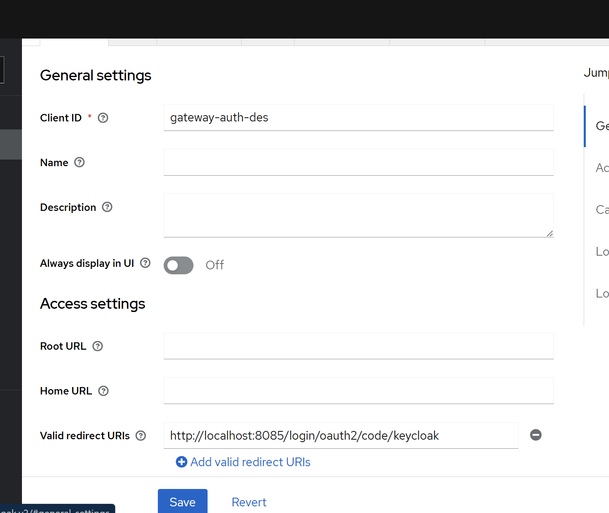
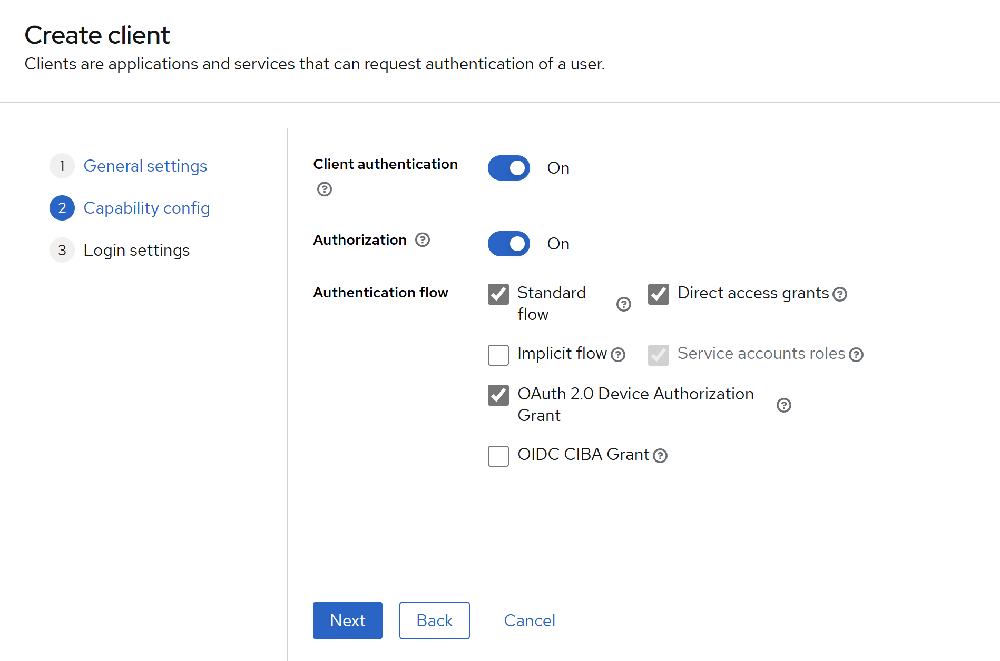
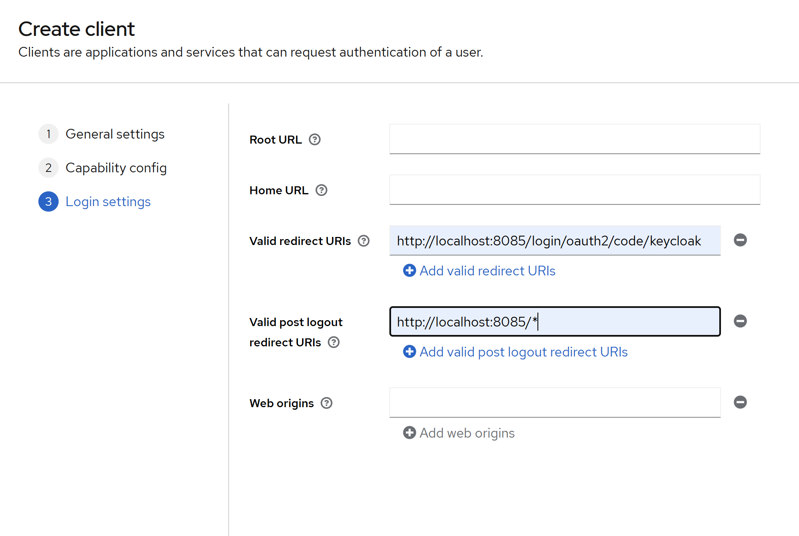
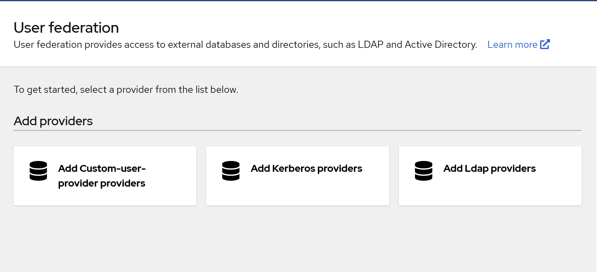
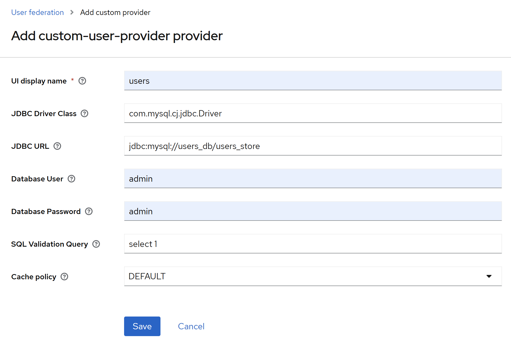

## Configurando Keycloak

Este documento fornece instruções detalhadas sobre como configurar o Keycloak.

## Acessando Keycloak

1. Acesse o Keycloak em [http://keycloak.localhost:8081](http://keycloak.localhost:8081) ou [http://localhost:8080/admin](http://localhost:8080/admin).
2. Use as credenciais padrão:
   - **Usuário**: `admin`
   - **Senha**: `admin`

## Configurando Realm e Clientes

1. **Criar um novo Realm**:
   - Vá para a seção "Realms" no menu.
   - Clique em "Create Realm".
   - Insira o nome do realm e clique em "Create".

2. **Configurar Client ID**:
   - Dentro do realm recém-criado, vá para a seção "Clients" no menu lateral.
   - Clique em "Create" para adicionar um novo cliente.
   - Insira um nome para o cliente e clique em "Save".
   - Atribua um `Client ID` e outras configurações necessárias, como URLs de redirecionamento, conforme necessário.

   

3. **Ativar Client Authentication**:
   - Dentro das configurações do cliente recém-criado, vá para a guia "Settings".
   - Em "Client Authentication", ative a opção conforme necessário para autenticação do cliente.

4. **Configurar Authorization**:
   - Dentro das configurações do cliente, vá para a guia "Authorization".
   - Marque as opções de autorização desejadas, como "Standard Flow", "Direct Access Grants", e "OAuth 2.0 Authorization Grant", conforme necessário para suas necessidades de segurança.
   - Essas opções oferecem diferentes métodos de autenticação e autorização para o cliente.

   

   **Explicação dos Tópicos de Segurança Ativados**:

   - **Standard Flow**: Esse fluxo é recomendado para aplicativos baseados em navegador, onde o usuário interage diretamente com o cliente por meio de um navegador da web. Ele envolve redirecionamentos de URL e trocas de tokens para autenticação e autorização.

   - **Direct Access Grants**: Este método permite que clientes obtenham tokens de acesso diretamente enviando credenciais do usuário ao servidor de autenticação. É útil para aplicativos clientes que não podem manter segredos de cliente de forma segura.

   - **OAuth 2.0 Authorization Grant**: Esse tipo de concessão OAuth permite que clientes acessem recursos protegidos em nome de um usuário. Ele é amplamente utilizado para delegação de autorização e acesso controlado a recursos protegidos.

5. **Configurar Redirect URIs**:
   - Dentro das configurações do cliente, vá para a guia "Settings".
   - Em "Valid Redirect URIs", adicione a URI de redirecionamento adequada, por exemplo: `http://localhost:8085/login/oauth2/code/keycloak`.

6. **Configurar Post Logout Redirect URIs**:
   - Dentro das configurações do cliente, vá para a guia "Settings".
   - Em "Valid Post Logout Redirect URIs", adicione a URI de redirecionamento pós-logout adequada, por exemplo: `http://localhost:8085/*`.

   

7. **Configurar Custom User Provider**:
   - Ainda na seção "User Federation", selecione "Add provider" e escolha "Custom User Federation" como o tipo de provedor.
   - Configure os detalhes necessários para o provedor personalizado, como o JAR do provedor e outras configurações específicas.
      - Configure as seguintes informações para se integrar com a base de dados de usuários MySQL:
     - **JDBC URL**: jdbc:mysql://users_db:3306/users_store
     - **Database User**: admin
     - **Database Password**: admin
   - Salve as configurações.

   

   

8. **Explicação sobre User Federation**:
   - O User Federation no Keycloak permite integrar fontes de identidade externas, como bancos de dados de usuários, LDAP, etc., com o sistema de gerenciamento de identidade do Keycloak. Isso possibilita que os usuários existentes em sistemas legados ou externos sejam autenticados e autorizados através do Keycloak, proporcionando uma experiência de login centralizada e segura para todos os aplicativos da sua organização.